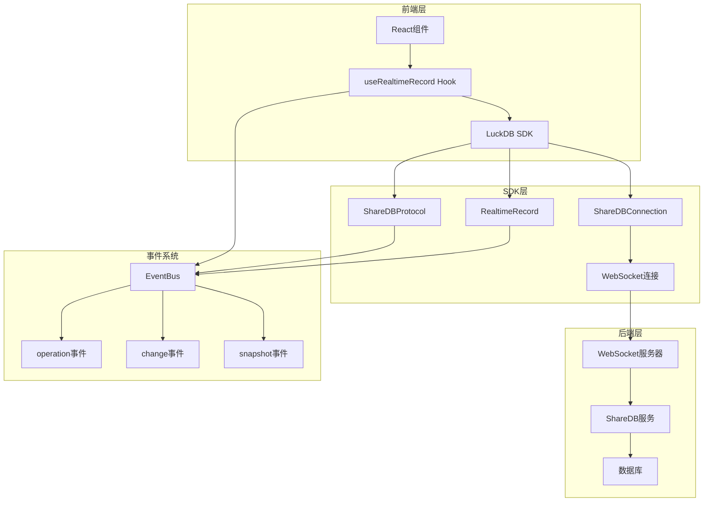
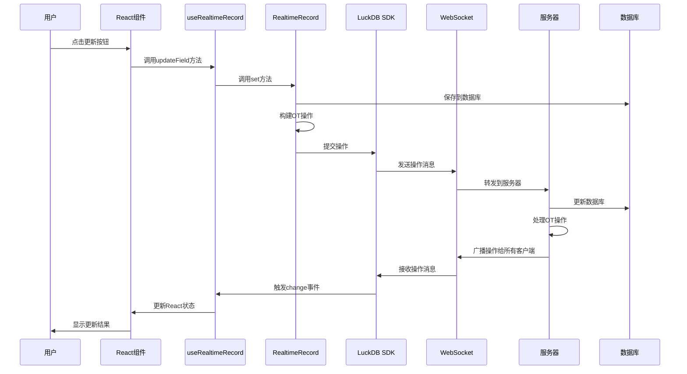
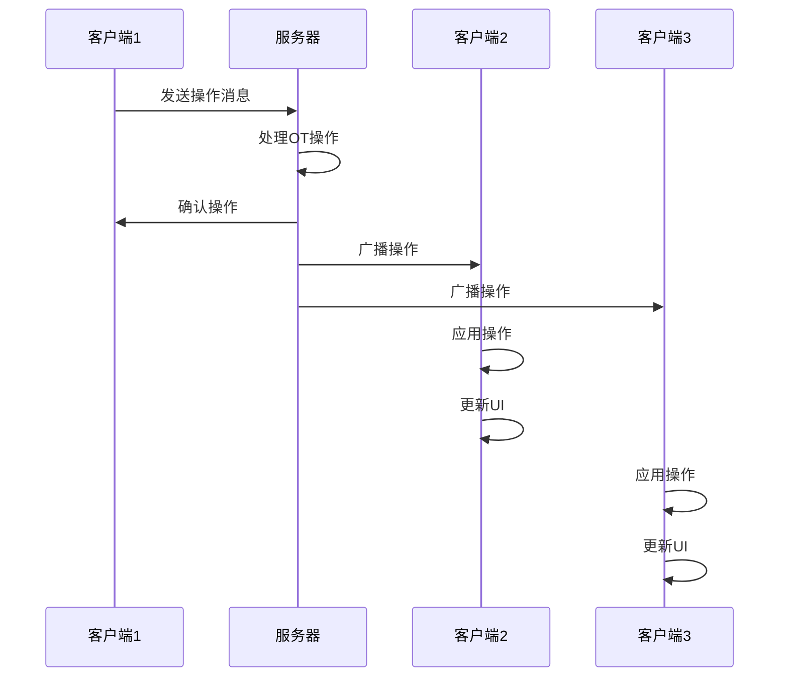
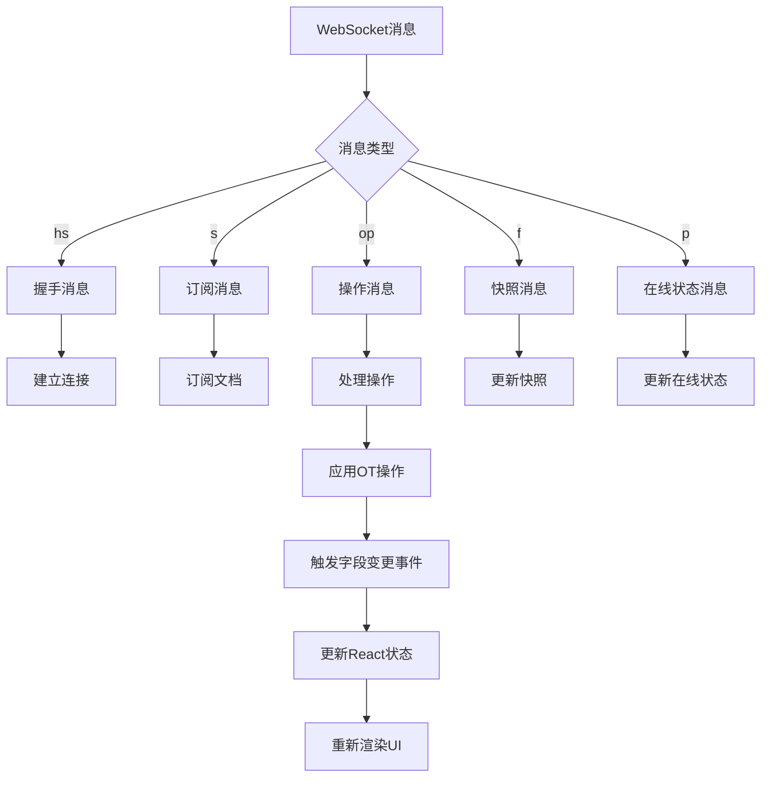
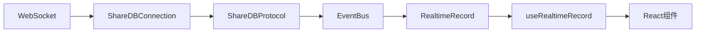
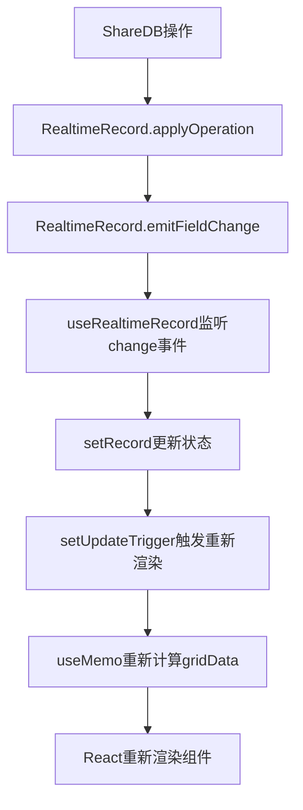

# 实时协作数据流架构文档

## 系统架构概览

EasyGrid实时协作系统采用基于ShareDB的OT（Operational Transformation）架构，支持多用户实时协作编辑。

### 核心组件



## 详细数据流向

### 1. 用户操作流程



### 2. 跨客户端同步流程



### 3. ShareDB消息处理流程



## 核心数据结构

### ShareDB消息格式

```typescript
interface ShareDBMessage {
  a: string;        // 动作类型: 'hs'|'s'|'op'|'f'|'p'
  c?: string;       // 集合名称
  d?: string;       // 文档ID
  v?: number;       // 版本号
  op?: OTOperation[]; // 操作数组
  data?: any;       // 数据
  error?: any;      // 错误信息
}
```

### OT操作格式

```typescript
interface OTOperation {
  p: string[];      // 操作路径
  oi?: any;         // 插入的值
  od?: any;         // 删除的值
}
```

### 字段变更事件

```typescript
interface FieldChangeEvent {
  fieldId: string;
  oldValue: any;
  newValue: any;
  timestamp: number;
}
```

## 事件系统架构

### 事件类型

1. **connection**: 连接状态变化
2. **operation**: ShareDB操作事件
3. **snapshot**: 文档快照事件
4. **change**: 字段变更事件
5. **error**: 错误事件

### 事件流



### 事件监听器注册

```typescript
// ShareDBConnection注册消息处理器
this.shareDBConnection.registerMessageHandler('protocol', (message) => {
  this.shareDBProtocol?.handleMessage(message);
});

// RealtimeRecord监听操作事件
this.eventBus.on('operation', (event) => {
  if (event.collection === `rec_${this.tableId}` && event.docId === this.recordId) {
    for (const operation of event.operation) {
      this.applyOperation(operation);
    }
  }
});

// useRealtimeRecord监听字段变更
recordClient.on('change', (fieldId: string, newValue: any) => {
  setRecord(prev => ({
    ...prev,
    data: { ...prev.data, [fieldId]: newValue },
    _updateTime: Date.now()
  }));
});
```

## React状态管理

### 状态更新策略

```typescript
// 1. 使用updateTrigger强制重新渲染
const [updateTrigger, setUpdateTrigger] = useState(0);

// 2. 在数据更新时触发
setUpdateTrigger(prev => prev + 1);

// 3. 在useMemo中使用
const gridData = useMemo(() => {
  return records.map(record => ({
    id: record.id,
    ...record.data,
  }));
}, [records, updateTrigger]);
```

### 状态更新流程



## 错误处理机制

### 连接错误处理

```typescript
// WebSocket连接错误
this.socket.addEventListener('error', (event) => {
  console.error('[ShareDB] WebSocket错误:', event);
  this.setState('error');
});

// 消息解析错误
try {
  const message = JSON.parse(event.data);
  // 处理消息
} catch (error) {
  console.error('[ShareDB] 消息解析错误:', error);
  this.eventBus.emit('error', { error });
}
```

### 操作错误处理

```typescript
// 数据库保存错误
try {
  await this.luckDBInstance.updateRecord(this.tableId, this.recordId, data);
} catch (error) {
  console.error('[RealtimeRecord] 数据库保存失败:', error);
  // 恢复本地字段值
  this.fields[fieldId] = oldValue;
  throw error;
}
```

## 性能优化策略

### 1. 防抖和节流

```typescript
// 防抖频繁的UI更新
const debouncedUpdate = useMemo(
  () => debounce((data) => {
    setRecords(data);
    setUpdateTrigger(prev => prev + 1);
  }, 100),
  []
);
```

### 2. 内存管理

```typescript
// 清理事件监听器
useEffect(() => {
  return () => {
    if (recordClient) {
      recordClient.unsubscribe();
    }
    if (handleOperation && sdk) {
      sdk.realtime.off('field-change', handleOperation);
    }
  };
}, []);
```

### 3. 状态优化

```typescript
// 使用useCallback避免不必要的重新渲染
const handleFieldChange = useCallback((fieldId: string, newValue: any) => {
  setRecord(prev => ({
    ...prev,
    data: { ...prev.data, [fieldId]: newValue },
    _updateTime: Date.now()
  }));
}, []);
```

## 调试和监控

### 日志策略

```typescript
// 使用版本标识符避免缓存问题
console.log('🚀 App 启动 (v2.1) - 修复事件监听问题');

// 使用不同颜色区分日志类型
console.log('🔄 收到字段变化 (v2.1):', { fieldId, newValue });
console.log('📡 收到实时记录更新 (v2.1):', realtimeRecord);
console.log('🔧 Grid 数据更新:', data);
```

### 性能监控

```typescript
// 监控操作处理时间
const startTime = performance.now();
this.applyOperation(operation);
const endTime = performance.now();
console.log(`操作处理耗时: ${endTime - startTime}ms`);
```

## 部署和配置

### 环境配置

```typescript
const config = {
  baseUrl: process.env.NODE_ENV === 'production' 
    ? 'https://api.easygrid.com' 
    : 'http://localhost:8080',
  debug: process.env.NODE_ENV === 'development',
  reconnectInterval: 5000,
  maxReconnectAttempts: 10,
  heartbeatInterval: 30000
};
```

### WebSocket配置

```typescript
const wsUrl = `${config.baseUrl.replace('http', 'ws')}/socket?token=${accessToken}`;

this.socket = new ReconnectingWebSocket(wsUrl, [], {
  maxReconnectionAttempts: this.maxReconnectAttempts,
  reconnectionDelayGrowFactor: 1.5,
  minReconnectionDelay: 1000,
  maxReconnectionDelay: 5000,
  connectionTimeout: 10000,
});
```

## 测试策略

### 单元测试

```typescript
// 测试RealtimeRecord操作应用
describe('RealtimeRecord', () => {
  it('should apply operation correctly', () => {
    const operation = {
      p: ['fields', 'fieldId'],
      oi: 'newValue'
    };
    
    record.applyOperation(operation);
    
    expect(record.get('fieldId')).toBe('newValue');
  });
});
```

### 集成测试

```typescript
// 测试跨标签页同步
describe('Cross-tab synchronization', () => {
  it('should sync changes between tabs', async () => {
    // 在第一个标签页更新数据
    await updateField('fieldId', 'newValue');
    
    // 验证第二个标签页接收到更新
    await waitFor(() => {
      expect(getFieldValue('fieldId')).toBe('newValue');
    });
  });
});
```

### 端到端测试

```typescript
// 使用Playwright测试完整流程
test('real-time collaboration', async ({ page }) => {
  await page.goto('/demo');
  await page.click('[data-testid="update-button"]');
  
  // 验证UI更新
  await expect(page.locator('[data-testid="field-value"]')).toHaveText('1298');
});
```

## 故障排除指南

### 常见问题

1. **UI不更新**
   - 检查React状态更新
   - 验证事件监听器注册
   - 确认ShareDBProtocol注册

2. **跨标签页不同步**
   - 检查WebSocket连接
   - 验证ShareDB消息处理
   - 确认事件系统工作

3. **连接不稳定**
   - 检查网络连接
   - 验证WebSocket配置
   - 确认重连机制

### 调试工具

```typescript
// 启用调试模式
const sdk = new LuckDB({
  baseUrl: 'http://localhost:8080',
  debug: true
});

// 监听所有事件
sdk.realtime.on('*', (event) => {
  console.log('Event:', event);
});
```

---

*本文档详细描述了EasyGrid实时协作系统的数据流架构，可作为开发和维护的参考。*
