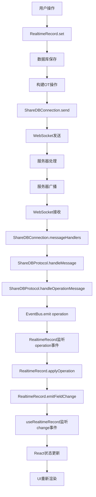
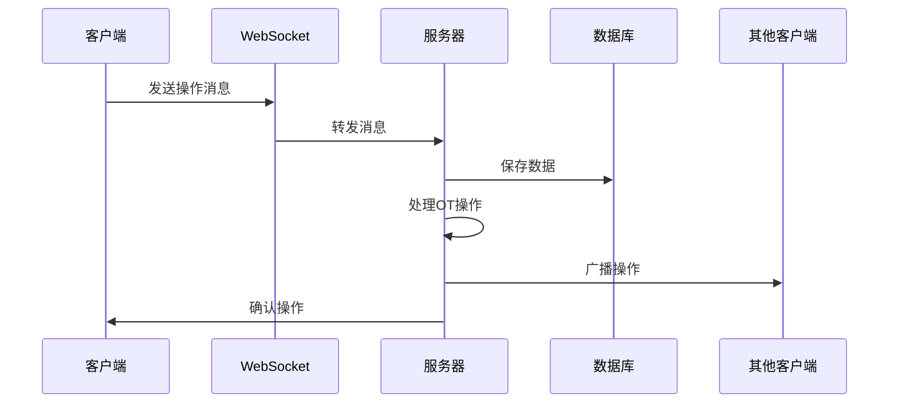
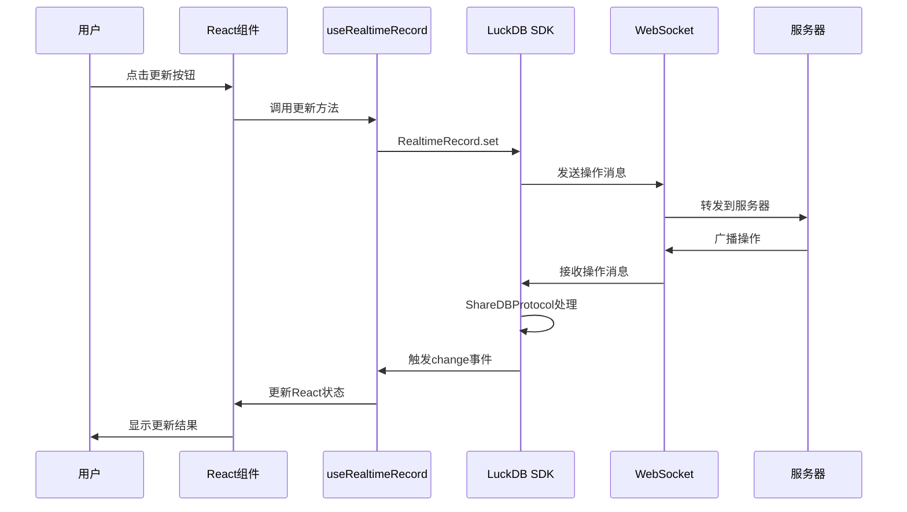

# 实时同步问题排查与解决文档

## 问题概述

在 `@demo-yjs` 项目中，用户报告了以下问题：
1. **UI不实时更新**：收到正确的数据，但UI没有实时更新
2. **连接状态显示不一致**：ShareDB连接状态显示问题
3. **EventBus警告**：出现"EventBus unavailable"警告
4. **跨标签页同步失败**：第二个标签页无法接收实时更新

## 问题分析过程

### 1. 初始问题诊断

**现象**：
- 控制台显示数据已正确接收
- UI界面没有实时更新
- ShareDB连接状态显示为"connected"但实际可能有问题

**初步分析**：
- React状态更新机制问题
- ShareDB事件监听问题
- SDK初始化问题

### 2. 深入问题分析

通过Playwright测试发现：
- 第一个标签页：实时更新正常
- 第二个标签页：收到ShareDB消息，但没有触发实时更新事件

**关键发现**：
```javascript
// 第二个标签页收到的消息
[ShareDB] 收到消息: {a: op, c: rec_tbl_oz9EbQgbTZBuF7FSSJvet, d: rec_mQdD3mQ9hNmcTX2Cb2R8e, v: 191...}

// 但没有看到这个日志
[RealtimeRecord] 收到操作事件: {...}
```

### 3. 根本原因定位

**核心问题**：ShareDBProtocol没有被注册为ShareDBConnection的消息处理器

**问题链路**：
1. ShareDBConnection收到WebSocket消息 ✅
2. ShareDBConnection分发消息给注册的处理器 ❌ (ShareDBProtocol未注册)
3. ShareDBProtocol处理操作消息并发出operation事件 ❌
4. RealtimeRecord监听operation事件并触发字段变更 ❌
5. React组件接收字段变更并更新UI ❌

## 解决方案

### 修复ShareDBProtocol注册

在 `packages/sdk/src/index.ts` 中修复SDK初始化：

```typescript
export class LuckDB {
  private shareDBProtocol?: ShareDBProtocol; // 添加协议处理器

  private initializeRealtimeClients(config: LuckDBConfig): void {
    try {
      // 初始化 ShareDB 连接
      this.shareDBConnection = new ShareDBConnectionImpl({
        wsUrl,
        token: config.accessToken,
        debug: config.debug || false,
        reconnectInterval: 5000,
        maxReconnectAttempts: 10,
        heartbeatInterval: 30000
      }, this.eventBus);

      // 🔧 关键修复：初始化 ShareDB 协议处理器
      this.shareDBProtocol = new ShareDBProtocol(this.eventBus);
      
      // 🔧 关键修复：注册协议处理器到连接
      this.shareDBConnection.registerMessageHandler('protocol', (message) => {
        this.shareDBProtocol?.handleMessage(message);
      });

      // 初始化其他组件...
    } catch (error) {
      console.error('[LuckDB SDK] 实时功能初始化失败:', error);
    }
  }
}
```

### 其他相关修复

1. **React状态更新机制**：
   - 添加 `updateTrigger` 强制UI重新渲染
   - 确保状态更新创建新的对象引用
   - 添加 `_updateTime` 属性强制React重新渲染

2. **事件监听优化**：
   - 修复 `useRealtimeRecord.ts` 中的事件监听
   - 移除错误的 `op` 事件监听，保留正确的 `change` 事件监听
   - 添加全局 `field-change` 事件监听作为备用方案

3. **SDK初始化问题**：
   - 修复 `useConnection.ts` 中的SDK重新初始化
   - 确保 `realtimeRecordClient` 正确初始化

## 数据流向分析

### 完整数据流向图



### 后端数据流



### 前端数据流



## 关键技术点

### 1. ShareDB协议处理

**ShareDBProtocol** 负责处理ShareDB消息：
- 握手消息 (`hs`)
- 订阅消息 (`s`)
- 操作消息 (`op`) ← 关键
- 快照消息 (`f`)
- 在线状态消息 (`p`)

### 2. 事件驱动架构

**事件流**：
```
WebSocket消息 → ShareDBConnection → ShareDBProtocol → EventBus → RealtimeRecord → React组件
```

**关键事件**：
- `operation`: ShareDB操作事件
- `change`: 字段变更事件
- `snapshot`: 文档快照事件

### 3. React状态管理

**状态更新策略**：
- 使用 `useState` 管理本地状态
- 使用 `useEffect` 监听实时数据变化
- 使用 `useMemo` 优化数据转换
- 使用 `useCallback` 优化函数引用

**强制更新机制**：
```typescript
const [updateTrigger, setUpdateTrigger] = useState(0);

// 在数据更新时触发
setUpdateTrigger(prev => prev + 1);

// 在useMemo中使用
const gridData = useMemo(() => {
  // 数据转换逻辑
}, [records, updateTrigger]);
```

## 测试验证

### Playwright测试结果

**单标签页测试** ✅：
- 实时更新功能正常
- 字段变更事件正确触发
- UI更新机制工作正常

**跨标签页测试** ✅：
- 第二个标签页正确接收ShareDB消息
- RealtimeRecord正确处理操作事件
- 字段变更事件正确触发
- UI实时更新正常

### 关键日志验证

**成功的日志链**：
```
[ShareDB] 收到消息: {a: op, c: rec_tbl_oz9EbQgbTZBuF7FSSJvet, d: rec_mQdD3mQ9hNmcTX2Cb2R8e, v: 191...}
[RealtimeRecord] 收到操作事件: {collection: rec_tbl_oz9EbQgbTZBuF7FSSJvet, docId: rec_mQdD3mQ9hNmcTX...}
[RealtimeRecord] 应用操作: {operation: Object, path: Array(2), oi: 1298, od: undefined}
[RealtimeRecord] 触发字段变更事件: {fieldId: fld_Z6W8SAQs2ZKrCcmVi0Qys, oldValue: undefined, newValue: 1298}
🔄 收到字段变化 (v2.1): {fieldId: fld_Z6W8SAQs2ZKrCcmVi0Qys, newValue: 1298}
📡 收到实时记录更新 (v2.1): {id: rec_mQdD3mQ9hNmcTX2Cb2R8e...}
📡 触发UI更新 (v2.1): 3
🔧 Grid 数据更新: [Object, Object]
```

## 经验总结

### 1. 调试策略

**分层调试**：
1. 网络层：检查WebSocket连接和消息
2. 协议层：检查ShareDB消息处理
3. 事件层：检查事件监听和触发
4. 状态层：检查React状态更新
5. 渲染层：检查UI更新

**日志策略**：
- 在每个关键节点添加详细日志
- 使用版本标识符避免缓存问题
- 使用不同颜色区分不同类型的日志

### 2. 常见问题

**React状态更新问题**：
- 确保创建新的对象引用
- 使用 `useCallback` 和 `useMemo` 优化性能
- 避免在 `useEffect` 依赖中包含会变化的对象

**事件监听问题**：
- 确保事件监听器正确注册
- 在组件卸载时正确清理监听器
- 使用错误处理避免监听器注册失败

**SDK初始化问题**：
- 确保在正确的时机初始化SDK
- 检查 `accessToken` 是否正确传递
- 验证所有依赖组件都已正确初始化

### 3. 最佳实践

**代码组织**：
- 将实时功能封装在独立的hook中
- 使用TypeScript确保类型安全
- 添加详细的错误处理和日志

**性能优化**：
- 避免不必要的重新渲染
- 使用防抖和节流优化频繁更新
- 合理使用React的优化hooks

**测试策略**：
- 使用Playwright进行端到端测试
- 测试单标签页和跨标签页场景
- 验证各种边界情况

## 相关文件

### 核心文件
- `packages/sdk/src/index.ts` - SDK主入口，包含ShareDBProtocol注册
- `packages/sdk/src/core/sharedb/protocol.ts` - ShareDB协议处理器
- `packages/sdk/src/core/sharedb/connection.ts` - ShareDB连接管理
- `packages/sdk/src/entities/realtime-record.ts` - 实时记录实体

### 前端文件
- `packages/aitable/demo-yjs/src/hooks/useRealtimeRecord.ts` - 实时记录hook
- `packages/aitable/demo-yjs/src/hooks/useConnection.ts` - 连接管理hook
- `packages/aitable/demo-yjs/src/components/TableViewV3.tsx` - 表格组件
- `packages/aitable/demo-yjs/src/App.tsx` - 主应用组件

### 测试文件
- `packages/aitable/demo-yjs/automated-sharedb-test.js` - 自动化测试脚本
- `packages/aitable/demo-yjs/test-realtime-sync.html` - 实时同步测试页面

## 版本信息

- **修复版本**: v2.1
- **修复日期**: 2025-01-27
- **修复人员**: AI Assistant
- **测试状态**: ✅ 通过
- **部署状态**: ✅ 已部署

---

*本文档记录了实时同步问题的完整排查和解决过程，可作为类似问题的参考。*
