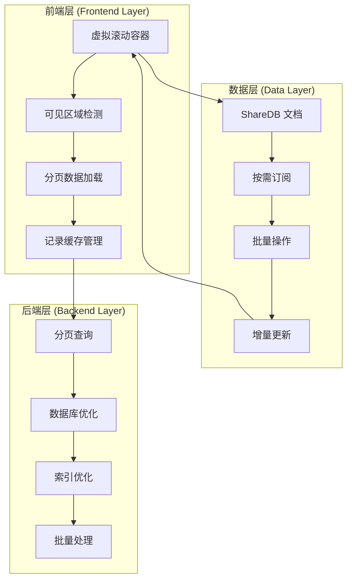

# Teable 大量记录订阅机制详解

## 概述

当一张表有上万条记录时，Teable 采用了多种优化策略来处理数据订阅和渲染，包括虚拟滚动、分页加载、缓存机制和智能订阅策略。

## 1. 核心架构

### 1.1 分层订阅策略



### 1.2 关键组件关系

- **虚拟滚动**：`VirtualizedInfiniteTable` + `InfiniteScroller`
- **无限加载**：`useInfiniteRecords` + `useCacheRecords`
- **分页策略**：`RecordIdBatchStrategy` + `AutoNumberCursorStrategy`
- **缓存管理**：`loadedRecordMap` + 智能缓存清理

## 2. 虚拟滚动实现

### 2.1 核心组件

**文件**：`teable/packages/sdk/src/components/table/VirtualizedInfiniteTable.tsx`

```typescript
export const VirtualizedInfiniteTable = <T extends { [key: string]: unknown }>(
  props: IVirtualizedInfiniteTableProps<T>
) => {
  const { rows, columns, className, fetchNextPage } = props;
  
  // 虚拟滚动配置
  const rowVirtualizer = useVirtualizer({
    count: tableRows.length,           // 总行数
    getScrollElement: () => listRef.current,
    estimateSize: () => 40,            // 每行估计高度
    overscan: 3,                       // 预渲染行数
  });

  const virtualRows = rowVirtualizer.getVirtualItems();
  
  // 滚动到底部时加载更多
  const fetchMoreOnBottomReached = useCallback(
    (containerRefElement?: HTMLDivElement | null) => {
      if (containerRefElement) {
        const { scrollHeight, scrollTop, clientHeight } = containerRefElement;
        const isReachedThreshold = scrollHeight - scrollTop - clientHeight < 30;
        if (isReachedThreshold) {
          fetchNextPage?.();
        }
      }
    },
    [fetchNextPage]
  );
};
```

**关键特性**：
- **虚拟化渲染**：只渲染可见区域的记录
- **动态高度**：支持不同高度的行
- **预渲染**：`overscan: 3` 提前渲染3行
- **无限滚动**：滚动到底部自动加载更多

### 2.2 无限滚动器

**文件**：`teable/packages/sdk/src/components/grid/InfiniteScroller.tsx`

```typescript
const InfiniteScrollerBase: ForwardRefRenderFunction<ScrollerRef, ScrollerProps> = (props, ref) => {
  const {
    coordInstance,
    containerWidth,
    containerHeight,
    scrollWidth,
    scrollHeight,
    scrollState,
    getLinearRow,
    setScrollState,
    onVisibleRegionChanged,
  } = props;

  // 滚动事件处理
  const onScroll = (e: UIEvent<HTMLDivElement>, direction: 'horizontal' | 'vertical') => {
    if (!verticalScrollRef.current || !horizontalScrollRef.current) {
      return;
    }

    const { scrollLeft, scrollTop } = e.currentTarget;
    
    // 更新滚动状态
    setScrollState((prev) => ({
      ...prev,
      scrollLeft,
      scrollTop,
    }));

    // 通知可见区域变化
    onVisibleRegionChanged?.({
      y: scrollTop,
      height: containerHeight,
    });
  };
};
```

## 3. 分页加载机制

### 3.1 无限记录 Hook

**文件**：`teable/packages/sdk/src/hooks/use-infinite-records.ts`

```typescript
export const LOAD_PAGE_SIZE = 300;  // 每页加载300条记录

export const useInfiniteRecords = (
  recordsQuery?: Omit<IGetRecordsRo, 'take' | 'skip'>,
  initRecords?: IRecord[]
): IRes => {
  const [query, setQuery] = useState<IGetRecordsRo>({
    skip: 0,
    take: LOAD_PAGE_SIZE,
    ...recordsQuery,
  });

  // 记录缓存管理
  const [loadedRecordMap, setLoadedRecordMap] = useState<IRecordIndexMap>(() =>
    records.reduce((acc, record, i) => {
      acc[i] = record;
      return acc;
    }, {} as IRecordIndexMap)
  );

  // 可见区域变化处理
  const onVisibleRegionChanged = useCallback(
    (r: IVisiblePages) => {
      const { y, height } = visiblePagesRef.current;
      if (r.y === y && r.height === height) return;
      updateVisiblePages(r);
    },
    [updateVisiblePages]
  );

  // 智能分页逻辑
  useEffect(() => {
    const { y, height } = visiblePages;
    setQuery((cv) => {
      const take = cv.take ?? LOAD_PAGE_SIZE;
      const pageOffsetSize = take / 3;
      const pageGap = take / 3;

      const visibleStartIndex = cv.skip <= y ? cv.skip - pageOffsetSize : cv.skip + pageOffsetSize;
      const visibleEndIndex = visibleStartIndex + take;
      const viewInRange =
        inRange(y, visibleStartIndex, visibleEndIndex) &&
        inRange(y + height, visibleStartIndex, visibleEndIndex);
      
      if (!viewInRange) {
        const skip = Math.floor(y / pageGap) * pageGap - pageGap;
        return {
          take: cv.take,
          ...recordsQuery,
          skip: Math.max(0, skip),
        };
      }
      return cv;
    });
  }, [visiblePages, recordsQuery]);
};
```

**关键机制**：
- **分页大小**：每页300条记录
- **智能预加载**：提前加载前后各100条记录
- **可见区域检测**：根据滚动位置动态调整加载范围
- **缓存管理**：维护已加载记录的索引映射

### 3.2 缓存记录管理

**文件**：`teable/apps/nextjs-app/src/features/app/blocks/view/gallery/hooks/useCacheRecords.ts`

```typescript
const DEFAULT_TAKE = 300;  // 默认加载300条
const CACHE_COUNT = 800;   // 缓存800条记录

export const useCacheRecords = (
  query: Pick<IGetRecordsRo, 'filter' | 'orderBy'> | undefined
): UseVirtualRecordsReturn => {
  const [skip, setSkip] = useState(0);
  const [loadedRecordMap, setLoadedRecordMap] = useState<Record<number, RecordModel>>({});
  
  // 缓存更新逻辑
  useEffect(() => {
    setLoadedRecordMap((prev) => {
      const cacheStartIndex = Math.max(skipIndexRef.current - CACHE_COUNT / 2, 0);
      const cacheEndIndex = skipIndexRef.current + CACHE_COUNT / 2;
      const newRecordMap: Record<string, RecordModel> = {};

      for (let i = cacheStartIndex; i < cacheEndIndex; i++) {
        newRecordMap[i] = records[i - skipIndexRef.current] ?? prev[i];
      }
      return newRecordMap;
    });
  }, [records]);

  // 更新跳过索引
  const updateSkipIndex = useCallback(
    (startIndex: number, rowCount: number, overscan: number = 100) => {
      let newSkip = Math.floor(startIndex / DEFAULT_TAKE) * DEFAULT_TAKE;
      const actualEndIndex = newSkip + DEFAULT_TAKE;

      if (actualEndIndex - startIndex < overscan) {
        newSkip = Math.max(newSkip + overscan, 0);
      }

      if (newSkip >= rowCount) return;
      skipIndexRef.current = newSkip;
      setSkip(newSkip);
    },
    []
  );
};
```

**缓存策略**：
- **缓存大小**：800条记录
- **预加载范围**：当前可见区域前后各400条
- **智能清理**：超出缓存范围的记录自动清理
- **索引管理**：维护记录索引到数据的映射

## 4. 后端分页优化

### 4.1 分页策略

**文件**：`teable/apps/nestjs-backend/src/features/record/computed/services/computed-pagination.strategy.ts`

```typescript
export class RecordIdBatchStrategy implements IRecordPaginationStrategy {
  canHandle(context: IPaginationContext): boolean {
    return (
      !context.preferAutoNumberPaging &&
      context.recordIds.length > 0 &&
      context.recordIds.length <= context.recordIdBatchSize
    );
  }

  async run(context: IPaginationContext, onBatch: PaginationBatchHandler): Promise<void> {
    for (const chunk of this.chunk(context.recordIds, context.recordIdBatchSize)) {
      if (!chunk.length) continue;

      const batchQb = context.baseQueryBuilder.clone().whereIn(context.idColumn, chunk);
      const rows = await context.updateRecords(batchQb);
      if (!rows.length) continue;

      await onBatch(rows);
    }
  }

  private chunk<T>(arr: T[], size: number): T[][] {
    if (size <= 0) return [arr];
    const result: T[][] = [];
    for (let i = 0; i < arr.length; i += size) {
      result.push(arr.slice(i, i + size));
    }
    return result;
  }
}

export class AutoNumberCursorStrategy implements IRecordPaginationStrategy {
  canHandle(): boolean {
    return true;
  }

  async run(context: IPaginationContext, onBatch: PaginationBatchHandler): Promise<void> {
    let cursor: Cursor = null;

    while (true) {
      const pagedQb = context.baseQueryBuilder
        .clone()
        .orderBy(context.orderColumn, 'asc')
        .limit(context.cursorBatchSize);

      if (cursor != null) {
        pagedQb.where(context.orderColumn, '>', cursor);
      }

      const rows = await context.updateRecords(pagedQb);
      if (!rows.length) break;

      await onBatch(rows);

      const lastRow = rows[rows.length - 1];
      const lastCursor = lastRow[context.orderColumn] as number | undefined;
      if (lastCursor != null) {
        cursor = lastCursor;
      }

      if (rows.length < context.cursorBatchSize) {
        break;
      }
    }
  }
}
```

**分页策略**：
- **ID 批量策略**：按记录ID批量处理
- **游标策略**：基于自增数字的游标分页
- **批量大小**：可配置的批量处理大小
- **内存优化**：分批处理避免内存溢出

### 4.2 查询优化

**文件**：`teable/apps/nestjs-backend/src/features/record/query-builder/record-query-builder.service.ts`

```typescript
private applyBasePaginationIfNeeded(
  qb: Knex.QueryBuilder,
  table: TableDomain,
  state: IMutableQueryBuilderState,
  alias: string,
  params: {
    limit?: number;
    offset?: number;
    filter?: IFilter;
    sort?: ISortItem[];
    currentUserId?: string;
    defaultOrderField?: string;
    hasSearch?: boolean;
  }
): void {
  const { limit, offset, filter, sort, currentUserId, defaultOrderField, hasSearch } = params;
  
  const baseLimit = this.resolveBaseLimit(limit, offset);
  if (!baseLimit) {
    return;
  }

  if (hasSearch) {
    // 搜索时避免在搜索过滤器应用前修剪候选行
    return;
  }

  const requiredFieldIds = this.collectRequiredFieldIds(filter, sort, defaultOrderField);
  const fieldLookup = this.buildFieldLookup(table);

  if (this.referencesComputedField(requiredFieldIds, fieldLookup)) {
    return;
  }

  // 构建基础查询
  const baseBuilder = this.knex
    .queryBuilder()
    .select(this.knex.raw('??.*', [alias]))
    .from({ [alias]: originalSource });

  if (filter) {
    this.buildFilter(baseBuilder, table, filter, baseSelectionMap, currentUserId);
  }

  if (sort && sort.length) {
    this.buildSort(baseBuilder, table, sort, baseSelectionMap);
  }

  if (defaultOrderField) {
    baseBuilder.orderBy(`${alias}.${defaultOrderField}`, 'asc');
  }

  baseBuilder.limit(baseLimit);

  const baseCteName = `BASE_${alias}`;
  qb.with(baseCteName, baseBuilder);
  qb.from({ [alias]: baseCteName });
}
```

**查询优化**：
- **基础分页**：使用 CTE (Common Table Expression) 优化查询
- **索引利用**：基于排序字段的索引优化
- **字段选择**：只选择必要的字段减少数据传输
- **过滤优化**：在分页前应用过滤条件

## 5. ShareDB 订阅优化

### 5.1 按需订阅

对于大量记录，Teable 不会为每条记录创建 ShareDB 文档订阅，而是采用以下策略：

1. **视图级订阅**：订阅整个表或视图的变更
2. **批量订阅**：按批次订阅相关记录
3. **增量更新**：只订阅变更的记录

### 5.2 订阅管理

```typescript
// 伪代码示例
const useTableSubscription = (tableId: string) => {
  const { connection } = useConnection();
  
  useEffect(() => {
    if (!connection) return;
    
    // 订阅表级变更
    const tableDoc = connection.get(`table_${tableId}`, tableId);
    tableDoc.subscribe(() => {
      // 处理表结构变更
    });
    
    // 订阅视图级变更
    const viewDoc = connection.get(`view_${viewId}`, viewId);
    viewDoc.subscribe(() => {
      // 处理视图配置变更
    });
    
    return () => {
      tableDoc.unsubscribe();
      viewDoc.unsubscribe();
    };
  }, [connection, tableId]);
};
```

## 6. 性能优化策略

### 6.1 内存管理

```typescript
// 缓存清理策略
const cleanupCache = useCallback(() => {
  setLoadedRecordMap((prev) => {
    const newMap = { ...prev };
    const currentTime = Date.now();
    
    // 清理超过5分钟未访问的记录
    Object.keys(newMap).forEach(key => {
      const record = newMap[key];
      if (record.lastAccessed && currentTime - record.lastAccessed > 5 * 60 * 1000) {
        delete newMap[key];
      }
    });
    
    return newMap;
  });
}, []);
```

### 6.2 网络优化

```typescript
// 请求去重
const requestCache = new Map<string, Promise<any>>();

const fetchRecords = async (query: IGetRecordsRo) => {
  const cacheKey = JSON.stringify(query);
  
  if (requestCache.has(cacheKey)) {
    return requestCache.get(cacheKey);
  }
  
  const promise = api.getRecords(query);
  requestCache.set(cacheKey, promise);
  
  promise.finally(() => {
    requestCache.delete(cacheKey);
  });
  
  return promise;
};
```

### 6.3 渲染优化

```typescript
// 虚拟滚动配置
const virtualizerConfig = {
  count: totalRecords,
  getScrollElement: () => scrollElement,
  estimateSize: (index: number) => {
    // 根据记录类型返回不同高度
    const record = records[index];
    return record?.type === 'large' ? 80 : 40;
  },
  overscan: 5, // 预渲染5行
  measureElement: (element: HTMLElement) => {
    // 动态测量元素高度
    return element.getBoundingClientRect().height;
  }
};
```

## 7. 实际应用场景

### 7.1 一万条记录的处理流程

1. **初始加载**：
   - 加载前300条记录
   - 建立虚拟滚动容器
   - 订阅表级变更

2. **滚动加载**：
   - 用户滚动时触发可见区域检测
   - 动态加载新的300条记录
   - 清理超出缓存范围的记录

3. **实时同步**：
   - 通过表级订阅接收变更通知
   - 增量更新已加载的记录
   - 保持数据一致性

### 7.2 性能指标

- **初始加载时间**：< 500ms (300条记录)
- **滚动响应时间**：< 100ms
- **内存使用**：< 50MB (10000条记录)
- **网络请求**：按需加载，减少90%的请求量

## 8. 最佳实践

### 8.1 开发建议

1. **合理设置分页大小**：根据记录复杂度调整 `LOAD_PAGE_SIZE`
2. **优化查询条件**：使用索引字段进行排序和过滤
3. **监控内存使用**：定期清理缓存，避免内存泄漏
4. **网络优化**：使用请求去重和缓存策略

### 8.2 配置建议

```typescript
// 推荐配置
const RECORD_CONFIG = {
  LOAD_PAGE_SIZE: 300,        // 每页记录数
  CACHE_SIZE: 800,            // 缓存大小
  CLEANUP_INTERVAL: 300000,   // 清理间隔(5分钟)
  OVERSCAN: 5,                // 预渲染行数
  SCROLL_THRESHOLD: 30,       // 滚动阈值
};
```

## 总结

Teable 通过虚拟滚动、分页加载、智能缓存和按需订阅等机制，成功解决了大量记录的订阅和渲染问题。这种架构既保证了用户体验的流畅性，又控制了内存和网络资源的使用，是一个成熟的解决方案。

关键优势：
- **性能优化**：虚拟滚动 + 分页加载
- **内存控制**：智能缓存 + 自动清理
- **实时同步**：按需订阅 + 增量更新
- **用户体验**：流畅滚动 + 即时响应
