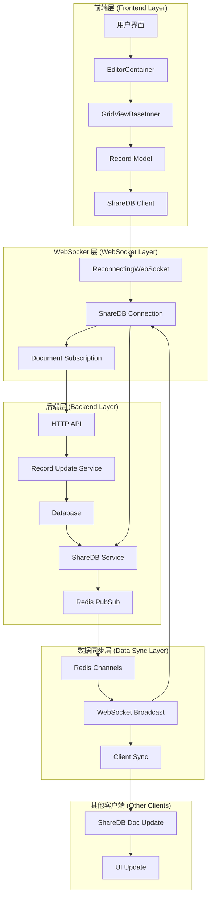
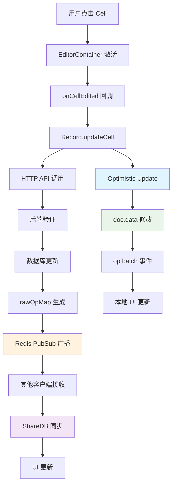
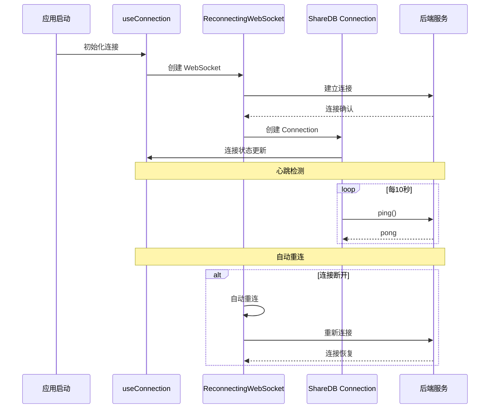
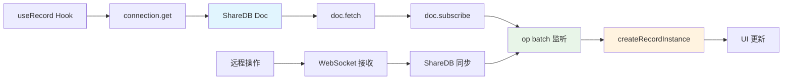
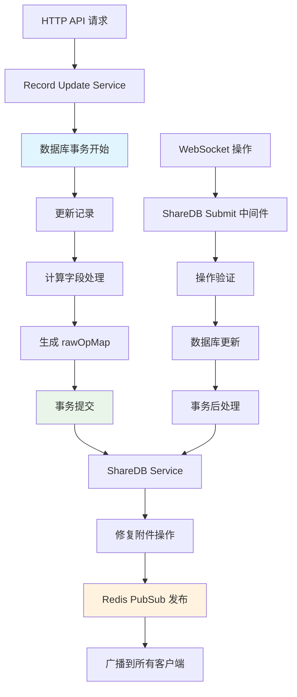
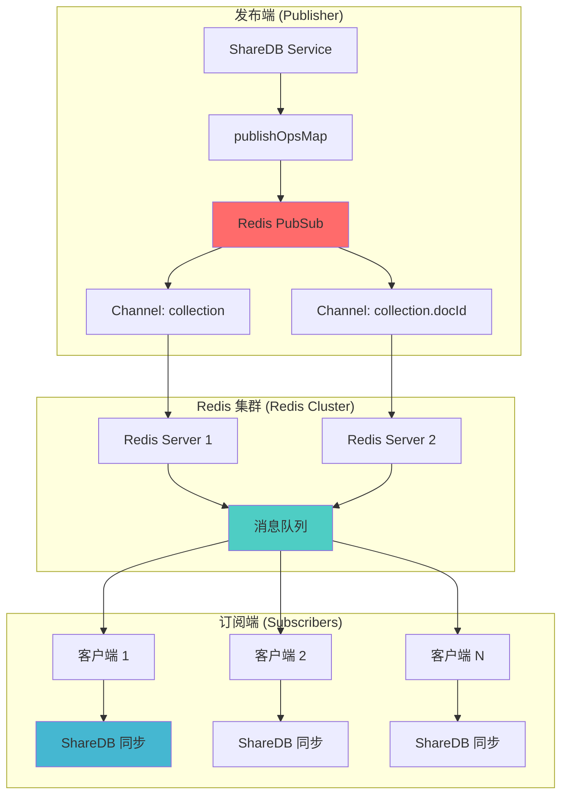
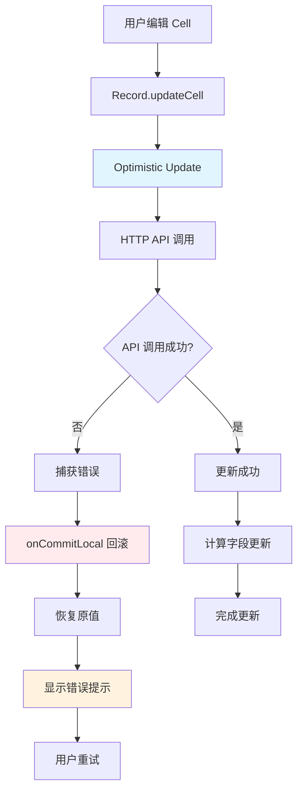
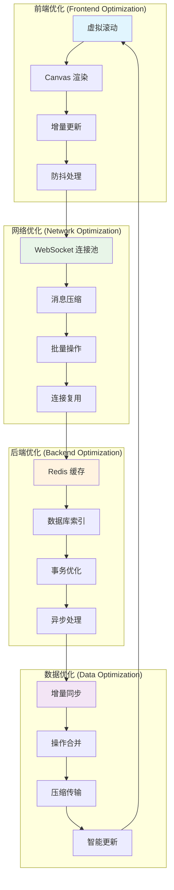
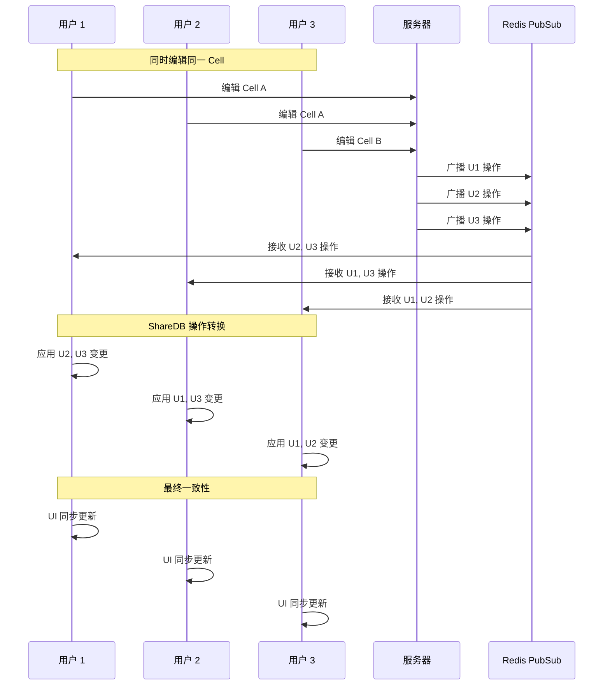
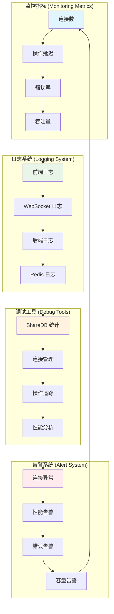

# Teable ShareDB 架构图表

## 1. 整体架构图

## 2. Cell 编辑数据流图

## 3. ShareDB 连接管理图

## 4. 文档订阅机制图

## 5. 后端处理流程图

## 6. Redis PubSub 广播图

## 7. 错误处理流程图

## 8. 性能优化架构图

## 9. 多用户协作场景图

## 10. 系统监控和调试图

这些图表详细展示了 Teable ShareDB 系统的各个层面，包括数据流转、连接管理、错误处理、性能优化和监控调试等方面，为理解和维护系统提供了全面的技术参考。
