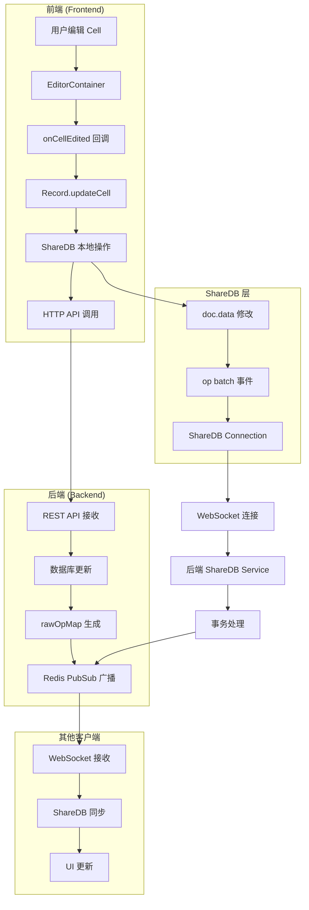
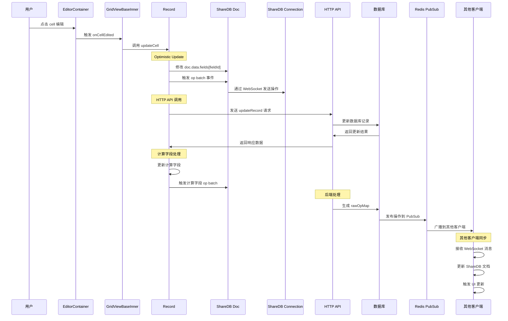
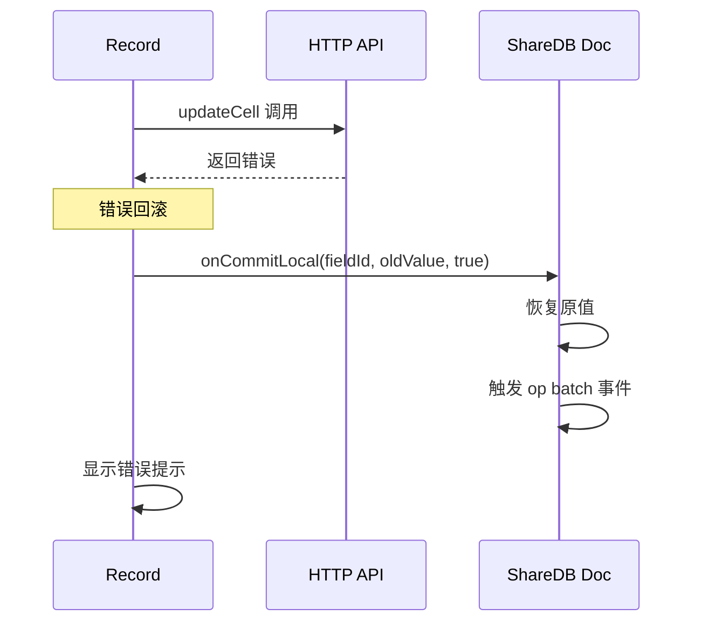

# Teable ShareDB Cell 编辑数据流转详解

## 1. 架构概览

### 1.1 整体架构

Teable 的实时协作基于 ShareDB (ShareDB) 实现，采用 WebSocket 连接进行实时通信。当用户编辑 cell 时，数据流转涉及前端、ShareDB、后端数据库和 Redis PubSub 系统。



### 1.2 核心组件关系

- **前端组件**：`EditorContainer` → `GridViewBaseInner` → `Record.updateCell`
- **ShareDB 层**：`Connection` → `Doc` → `op batch` 事件
- **后端服务**：`ShareDbService` → `RecordUpdateService` → `RedisPubSub`
- **数据同步**：`publishOpsMap` → `Redis PubSub` → 其他客户端

## 2. 连接建立

### 2.1 WebSocket 连接初始化

**文件**：`teable/packages/sdk/src/context/app/useConnection.tsx`

```typescript
export const useConnection = (path?: string) => {
  const [connected, setConnected] = useState(false);
  const [connection, setConnection] = useState<Connection>();
  const [socket, setSocket] = useState<ReconnectingWebSocket | null>(null);

  useEffect(() => {
    setSocket((prev) => {
      if (prev) {
        return prev;
      }
      return new ReconnectingWebSocket(path || getWsPath());
    });
  }, [path]);

  useEffect(() => {
    if (!socket) {
      return;
    }
    if (socket && !isConnected(socket)) {
      socket.reconnect();
    }
    const connection = new Connection(socket as Socket);
    setConnection(connection);

    // 事件监听
    connection.on('connected', onConnected);
    connection.on('disconnected', onDisconnected);
    connection.on('closed', onDisconnected);
    connection.on('error', shareDbErrorHandler);
    connection.on('receive', onReceive);
  }, [path, socket, refreshTime]);
```

**关键特性**：
- 使用 `ReconnectingWebSocket` 自动重连
- 10分钟心跳检测，1小时无活动自动关闭
- 2秒重连延迟
- 完整的错误处理和状态管理

### 2.2 文档订阅机制

**文件**：`teable/packages/sdk/src/hooks/use-record.ts`

```typescript
export const useRecord = (recordId: string | undefined, initData?: IRecord) => {
  const { connection, connected } = useConnection();
  const tableId = useTableId();

  useEffect(() => {
    if (!connection || !recordId) {
      return undefined;
    }
    const doc = connection.get(`${IdPrefix.Record}_${tableId}`, recordId);

    doc.fetch((err) => {
      if (err) {
        console.error('Failed to fetch document:', err);
        return;
      }
      setInstance(createRecordInstance(doc.data, doc));
    });

    const listeners = () => {
      setInstance(createRecordInstance(doc.data, doc));
    };

    doc.subscribe(() => {
      doc.on('op batch', listeners);
    });

    return () => {
      doc.removeListener('op batch', listeners);
      doc.listenerCount('op batch') === 0 && doc.unsubscribe();
      doc.listenerCount('op batch') === 0 && doc.destroy();
    };
  }, [connection, recordId, tableId]);
```

**关键机制**：
- 通过 `connection.get(collection, recordId)` 获取 ShareDB 文档
- 订阅 `op batch` 事件监听远程变更
- 自动清理监听器和文档资源

## 3. Cell 编辑流程

### 3.1 用户操作触发

**文件**：`teable/apps/nextjs-app/src/features/app/blocks/view/grid/GridViewBaseInner.tsx:367`

```typescript
const onCellEdited = useCallback(
  (cell: ICellItem, newVal: IInnerCell) => {
    const [, row] = cell;
    const record = recordMap[row];
    if (record === undefined) return;

    const [col] = cell;
    const fieldId = columns[col].id;
    const { type, data } = newVal;
    let newCellValue: unknown = null;

    switch (type) {
      case CellType.Select:
        newCellValue = data?.length ? data : null;
        break;
      case CellType.Text:
      case CellType.Number:
      case CellType.Boolean:
      default:
        newCellValue = data === '' ? null : data;
    }
    const oldCellValue = record.getCellValue(fieldId) ?? null;
    if (isEqual(newCellValue, oldCellValue)) return;
    record.updateCell(fieldId, newCellValue, { t, prefix: 'sdk' });
    return record;
  },
  [recordMap, columns, t]
);
```

**处理流程**：
1. 获取 cell 坐标和对应的 record
2. 根据 cell 类型处理新值
3. 比较新旧值，避免无意义更新
4. 调用 `record.updateCell` 执行更新

### 3.2 前端处理 - Record.updateCell

**文件**：`teable/packages/sdk/src/model/record/record.ts:91`

```typescript
async updateCell(
  fieldId: string,
  cellValue: unknown,
  localization?: { t: ILocaleFunction; prefix?: string }
) {
  const oldCellValue = this.fields[fieldId];
  try {
    // 1. 本地立即更新 (Optimistic Update)
    this.onCommitLocal(fieldId, cellValue);
    this.fields[fieldId] = cellValue;
    
    // 2. HTTP API 调用更新后端
    const [, tableId] = this.doc.collection.split('_');
    const res = await updateRecord(tableId, this.doc.id, {
      fieldKeyType: FieldKeyType.Id,
      record: {
        fields: {
          [fieldId]: cellValue === undefined ? null : cellValue,
        },
      },
    });
    
    // 3. 处理计算字段更新
    const computedField = Object.keys(this.fieldMap).filter(
      (fieldId) =>
        this.fieldMap[fieldId].type === FieldType.Link || this.fieldMap[fieldId].isComputed
    );
    if (computedField.length) {
      this.updateComputedField(computedField, res.data);
    }
  } catch (error) {
    // 4. 错误回滚
    this.onCommitLocal(fieldId, oldCellValue, true);

    if (error instanceof Error && localization) {
      toast.error(getHttpErrorMessage(error, localization.t, localization.prefix));
    }

    return error;
  }
}
```

**关键步骤**：
1. **Optimistic Update**：立即更新本地状态
2. **HTTP API 调用**：向后端发送更新请求
3. **计算字段处理**：更新相关的计算字段
4. **错误回滚**：失败时恢复原值

### 3.3 ShareDB 本地操作

**文件**：`teable/packages/sdk/src/model/record/record.ts:63`

```typescript
private onCommitLocal(fieldId: string, cellValue: unknown, undo?: boolean) {
  const oldCellValue = this.fields[fieldId];
  const operation = RecordOpBuilder.editor.setRecord.build({
    fieldId,
    newCellValue: cellValue,
    oldCellValue,
  });
  
  // 直接修改 ShareDB 文档数据
  this.doc.data.fields[fieldId] = cellValue;
  
  // 触发 op batch 事件
  this.doc.emit('op batch', [operation], false);
  
  if (this.doc.version) {
    undo ? this.doc.version-- : this.doc.version++;
  }
  this.fields[fieldId] = cellValue;
}
```

**ShareDB 操作**：
1. 构建操作对象 (RecordOpBuilder)
2. 直接修改 `doc.data.fields[fieldId]`
3. 触发 `op batch` 事件通知其他组件
4. 更新文档版本号

### 3.4 后端处理 - ShareDB Service

**文件**：`teable/apps/nestjs-backend/src/share-db/share-db.service.ts`

```typescript
@Injectable()
export class ShareDbService extends ShareDBClass {
  constructor(
    readonly shareDbAdapter: ShareDbAdapter,
    private readonly eventEmitterService: EventEmitterService,
    private readonly prismaService: PrismaService,
    private readonly cls: ClsService<IClsStore>,
    private readonly repairAttachmentOpService: RepairAttachmentOpService,
    @CacheConfig() private readonly cacheConfig: ICacheConfig,
    private readonly performanceCacheService: PerformanceCacheService
  ) {
    super({
      presence: true,
      doNotForwardSendPresenceErrorsToClient: true,
      db: shareDbAdapter,
      maxSubmitRetries: 3,
    });

    // Redis PubSub 配置
    const { provider, redis } = this.cacheConfig;
    if (provider === 'redis') {
      const redisPubsub = new RedisPubSub({ redisURI: redis.uri });
      this.pubsub = redisPubsub;
    }

    authMiddleware(this);
    this.use('submit', this.onSubmit);

    // 事务后处理
    this.prismaService.bindAfterTransaction(async () => {
      const rawOpMaps = this.cls.get('tx.rawOpMaps');
      this.cls.set('tx.rawOpMaps', undefined);

      const ops: IRawOpMap[] = [];
      if (rawOpMaps?.length) {
        ops.push(...rawOpMaps);
      }

      if (ops.length) {
        await this.updateTableMetaByRawOpMap(rawOpMaps);
        await this.publishOpsMap(rawOpMaps);
        this.eventEmitterService.ops2Event(ops);
      }
    });
  }
}
```

**后端处理流程**：
1. **认证中间件**：验证 WebSocket 连接权限
2. **Submit 中间件**：拦截和验证操作
3. **事务绑定**：在数据库事务完成后处理
4. **操作发布**：通过 Redis PubSub 广播变更

### 3.5 广播同步机制

**文件**：`teable/apps/nestjs-backend/src/share-db/share-db.service.ts:108`

```typescript
@Timing()
async publishOpsMap(rawOpMaps: IRawOpMap[] | undefined) {
  if (!rawOpMaps?.length) {
    return;
  }
  const repairAttachmentContext =
    await this.repairAttachmentOpService.getCollectionsAttachmentsContext(rawOpMaps);
  for (const rawOpMap of rawOpMaps) {
    for (const collection in rawOpMap) {
      const data = rawOpMap[collection];
      for (const docId in data) {
        const rawOp = data[docId] as EditOp | CreateOp | DeleteOp;
        const channels = [collection, `${collection}.${docId}`];
        rawOp.c = collection;
        rawOp.d = docId;
        const repairedOp = await this.repairAttachmentOpService.repairAttachmentOp(
          rawOp,
          repairAttachmentContext
        );
        this.pubsub.publish(channels, repairedOp, noop);

        if (this.shouldPublishAction(repairedOp)) {
          const tableId = collection.split('_')[1];
          this.publishRelatedChannels(tableId, repairedOp);
        }
      }
    }
  }
}
```

**广播机制**：
1. **修复附件操作**：处理附件相关的操作
2. **多频道发布**：`collection` 和 `collection.docId` 频道
3. **相关频道发布**：触发相关表和字段的更新
4. **Redis PubSub**：通过 Redis 广播到所有客户端

## 4. 关键代码分析

### 4.1 前端核心代码片段

#### EditorContainer 组件
```typescript
// 编辑器容器，处理 cell 编辑的 UI 交互
export const EditorContainerBase: ForwardRefRenderFunction<
  IEditorContainerRef,
  IEditorContainerProps
> = (props, ref) => {
  const { isEditing, activeCell, onChange } = props;
  
  // 处理编辑状态和焦点管理
  useEffect(() => {
    if ((cellContent as ICell).type === CellType.Loading) return;
    if (!activeCell || isEditing) return;
    editorRef.current?.setValue?.(cellContent.data);
  }, [cellContent, activeCell, isEditing]);
};
```

#### ShareDB 连接管理
```typescript
// 连接状态管理和自动重连
useConnectionAutoManage(socket, updateShareDb, {
  inactiveTimeout: 1000 * 60 * 60,  // 1小时无活动自动关闭
  reconnectDelay: 2000,              // 2秒重连延迟
});
```

### 4.2 后端核心代码片段

#### Redis PubSub 实现
```typescript
// Redis PubSub 驱动
export class RedisPubSub extends PubSub {
  client: Redis;
  observer: Redis;

  async _publish(channels: string[], data: unknown, callback: (err: ShareDBError | null) => void) {
    const message = JSON.stringify(data);
    const args = [message].concat(channels)];
    this.client.eval(PUBLISH_SCRIPT, 0, ...args).then(function () {
      callback(null);
    }, callback);
  }
}
```

#### 操作验证中间件
```typescript
private onSubmit = (
  context: ShareDBClass.middleware.SubmitContext,
  next: (err?: unknown) => void
) => {
  const [docType] = context.collection.split('_');
  
  if (docType !== IdPrefix.Record || !context.op.op) {
    return next(new Error('only record op can be committed'));
  }
  next();
};
```

### 4.3 ShareDB 配置

#### 服务配置
```typescript
super({
  presence: true,                              // 启用 Presence 功能
  doNotForwardSendPresenceErrorsToClient: true, // 不转发 Presence 错误
  db: shareDbAdapter,                          // 数据库适配器
  maxSubmitRetries: 3,                         // 最大重试次数
});
```

#### Redis 配置
```typescript
const devRedisOptions = {
  retryStrategy(times: number) {
    return Math.min(times * 50, 2000);
  },
  maxRetriesPerRequest: 5,
  reconnectOnError(err: unknown) {
    const message = err instanceof Error ? err.message : String(err);
    return (
      message.includes('Connection is closed') ||
      message.includes('READONLY') ||
      message.includes('ECONNRESET')
    );
  },
  autoResendUnfulfilledCommands: true,
  autoResubscribe: true,
  connectTimeout: 10000,
  commandTimeout: 5000,
};
```

## 5. 时序图

### 5.1 完整数据流时序图



### 5.2 错误处理时序图



## 6. 关键文件清单

### 6.1 前端文件

#### 连接管理
- `teable/packages/sdk/src/context/app/useConnection.tsx` - ShareDB 连接管理
- `teable/packages/sdk/src/context/app/useConnectionAutoManage.tsx` - 自动连接管理

#### 文档订阅
- `teable/packages/sdk/src/hooks/use-record.ts` - Record 文档订阅
- `teable/packages/sdk/src/hooks/use-fields.ts` - Field 文档订阅

#### 数据模型
- `teable/packages/sdk/src/model/record/record.ts` - Record 模型和 updateCell 方法
- `teable/packages/sdk/src/model/field/factory.ts` - Field 工厂

#### UI 组件
- `teable/apps/nextjs-app/src/features/app/blocks/view/grid/GridViewBaseInner.tsx` - 网格视图
- `teable/packages/sdk/src/components/grid/components/editor/EditorContainer.tsx` - 编辑器容器

### 6.2 后端文件

#### ShareDB 服务
- `teable/apps/nestjs-backend/src/share-db/share-db.service.ts` - ShareDB 核心服务
- `teable/apps/nestjs-backend/src/share-db/share-db.adapter.ts` - 数据库适配器
- `teable/apps/nestjs-backend/src/share-db/sharedb-redis.pubsub.ts` - Redis PubSub

#### 记录更新
- `teable/apps/nestjs-backend/src/features/record/record-modify/record-update.service.ts` - 记录更新服务
- `teable/apps/nestjs-backend/src/features/record/record-modify/record-modify.shared.service.ts` - 共享修改服务

#### 计算字段
- `teable/apps/nestjs-backend/src/features/record/computed/services/computed-orchestrator.service.ts` - 计算字段编排器

#### 认证和中间件
- `teable/apps/nestjs-backend/src/share-db/auth.middleware.ts` - ShareDB 认证中间件

### 6.3 配置文件

#### 缓存配置
- `teable/apps/nestjs-backend/src/configs/cache.config.ts` - 缓存配置

#### 事件系统
- `teable/apps/nestjs-backend/src/event-emitter/event-emitter.service.ts` - 事件发射器

## 7. 技术特性总结

### 7.1 实时协作特性
- **Optimistic Update**：本地立即更新，提供流畅的用户体验
- **操作转换 (OT)**：ShareDB 自动处理并发操作冲突
- **Presence 支持**：用户在线状态和光标位置同步
- **自动重连**：网络中断时自动恢复连接

### 7.2 性能优化
- **虚拟滚动**：支持大数据集的流畅渲染
- **增量更新**：只同步变更的数据
- **Redis PubSub**：高效的实时消息广播
- **计算字段缓存**：避免重复计算

### 7.3 错误处理
- **回滚机制**：操作失败时自动恢复原值
- **重试策略**：网络错误时自动重试
- **错误提示**：用户友好的错误信息
- **连接管理**：自动检测和恢复连接

### 7.4 扩展性
- **模块化设计**：清晰的组件分离
- **插件系统**：支持自定义字段类型
- **事件系统**：完整的事件监听和触发机制
- **多租户支持**：支持多用户协作

## 8. 总结

Teable 的 ShareDB Cell 编辑数据流转是一个复杂的实时协作系统，涉及前端 UI 交互、ShareDB 实时同步、后端数据处理和 Redis 消息广播。整个系统采用了 Optimistic Update 策略，确保用户操作的即时响应，同时通过 ShareDB 的操作转换机制保证数据一致性。后端通过 Redis PubSub 实现高效的实时消息广播，支持多用户同时编辑而不会产生冲突。

这种架构设计既保证了用户体验的流畅性，又确保了数据的最终一致性，是一个成熟的实时协作解决方案。
