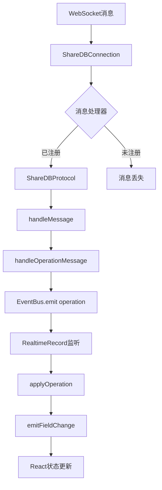

# 实时同步技术总结

## 问题回顾

这次实时同步问题的排查和解决过程历时较长，涉及多个技术层面的深度调试。以下是完整的技术总结。

## 技术栈分析

### 前端技术栈
- **React 18**: 使用Hooks进行状态管理
- **TypeScript**: 类型安全的JavaScript
- **Vite**: 现代前端构建工具
- **Playwright**: 端到端测试框架

### 后端技术栈
- **Go**: 后端服务语言
- **Gin**: Web框架
- **WebSocket**: 实时通信协议
- **ShareDB**: 实时协作框架

### 实时协作技术
- **OT (Operational Transformation)**: 操作转换算法
- **WebSocket**: 双向通信协议
- **EventBus**: 事件驱动架构
- **React状态管理**: 响应式UI更新

## 问题演进过程

### 阶段1: 表面问题
**现象**: UI不实时更新
**初步分析**: React状态更新问题
**修复尝试**: 
- 添加 `updateTrigger` 强制重新渲染
- 确保状态更新创建新对象引用
- 添加 `_updateTime` 属性

**结果**: 部分改善，但跨标签页仍有问题

### 阶段2: 深入分析
**现象**: 第二个标签页收到ShareDB消息但不更新
**深入分析**: 事件监听链路问题
**发现**: ShareDBProtocol未注册为消息处理器

**关键日志对比**:
```javascript
// 第一个标签页 (正常)
[ShareDB] 收到消息: {a: op, ...}
[RealtimeRecord] 收到操作事件: {...}  // ✅ 有这个
🔄 收到字段变化: {...}

// 第二个标签页 (异常)
[ShareDB] 收到消息: {a: op, ...}
// ❌ 缺少 [RealtimeRecord] 收到操作事件
```

### 阶段3: 根本原因定位
**根本问题**: ShareDBProtocol没有被注册为ShareDBConnection的消息处理器

**问题链路**:
```
WebSocket消息 → ShareDBConnection → ❌ 消息处理器缺失 → ShareDBProtocol → EventBus → RealtimeRecord
```

**修复方案**: 在SDK初始化时注册ShareDBProtocol
```typescript
// 关键修复代码
this.shareDBProtocol = new ShareDBProtocol(this.eventBus);
this.shareDBConnection.registerMessageHandler('protocol', (message) => {
  this.shareDBProtocol?.handleMessage(message);
});
```

## 技术深度分析

### ShareDB架构理解

ShareDB是一个基于OT的实时协作框架，其核心组件包括：

1. **ShareDBConnection**: 管理WebSocket连接
2. **ShareDBProtocol**: 处理ShareDB协议消息
3. **RealtimeRecord**: 管理单个记录的实时状态
4. **EventBus**: 事件分发系统

### 消息处理流程



### 事件驱动架构

系统采用事件驱动架构，事件流如下：

```
WebSocket → ShareDBConnection → ShareDBProtocol → EventBus → RealtimeRecord → React组件
```

**关键事件类型**:
- `operation`: ShareDB操作事件
- `change`: 字段变更事件  
- `snapshot`: 文档快照事件
- `connection`: 连接状态事件

## 调试方法论

### 分层调试策略

1. **网络层**: 检查WebSocket连接和消息传输
2. **协议层**: 检查ShareDB消息格式和处理
3. **事件层**: 检查事件监听和触发
4. **状态层**: 检查React状态更新
5. **渲染层**: 检查UI更新

### 日志策略

**版本标识符**: 使用版本号避免浏览器缓存问题
```typescript
console.log('🚀 App 启动 (v2.1) - 修复事件监听问题');
```

**分类日志**: 使用不同emoji区分日志类型
```typescript
console.log('🔄 收到字段变化:', data);      // 数据变化
console.log('📡 收到实时记录更新:', data);   // 实时更新
console.log('🔧 Grid 数据更新:', data);      // UI更新
console.log('✅ 操作成功:', data);          // 成功操作
console.log('❌ 操作失败:', error);          // 错误信息
```

### Playwright测试策略

**多标签页测试**: 验证跨标签页同步
```typescript
// 打开多个标签页
await browser.newPage();
await page2.goto('http://localhost:5173');

// 在第一个标签页操作
await page1.click('[data-testid="update-button"]');

// 验证第二个标签页更新
await expect(page2.locator('[data-testid="field-value"]')).toHaveText('1298');
```

## 性能优化经验

### React状态管理优化

1. **避免不必要的重新渲染**:
```typescript
const gridData = useMemo(() => {
  return records.map(record => ({ id: record.id, ...record.data }));
}, [records, updateTrigger]); // 明确依赖
```

2. **使用useCallback优化函数引用**:
```typescript
const handleFieldChange = useCallback((fieldId: string, newValue: any) => {
  setRecord(prev => ({ ...prev, data: { ...prev.data, [fieldId]: newValue } }));
}, []);
```

3. **强制更新机制**:
```typescript
const [updateTrigger, setUpdateTrigger] = useState(0);
// 在需要时触发
setUpdateTrigger(prev => prev + 1);
```

### 内存管理

1. **清理事件监听器**:
```typescript
useEffect(() => {
  return () => {
    if (recordClient) {
      recordClient.unsubscribe();
    }
    if (handleOperation && sdk) {
      sdk.realtime.off('field-change', handleOperation);
    }
  };
}, []);
```

2. **避免内存泄漏**:
```typescript
// 使用WeakMap存储临时数据
const tempData = new WeakMap();
```

## 错误处理最佳实践

### 分层错误处理

1. **网络层错误**:
```typescript
this.socket.addEventListener('error', (event) => {
  console.error('[ShareDB] WebSocket错误:', event);
  this.setState('error');
});
```

2. **协议层错误**:
```typescript
try {
  const message = JSON.parse(event.data);
  this.handleMessage(message);
} catch (error) {
  console.error('[ShareDB] 消息解析错误:', error);
  this.eventBus.emit('error', { error });
}
```

3. **业务层错误**:
```typescript
try {
  await this.luckDBInstance.updateRecord(tableId, recordId, data);
} catch (error) {
  console.error('[RealtimeRecord] 数据库保存失败:', error);
  // 恢复本地状态
  this.fields[fieldId] = oldValue;
  throw error;
}
```

### 错误恢复机制

1. **自动重连**:
```typescript
const reconnectInterval = setInterval(() => {
  if (!this.isConnected()) {
    this.connect();
  }
}, 5000);
```

2. **状态恢复**:
```typescript
// 从本地存储恢复状态
const savedState = localStorage.getItem('appState');
if (savedState) {
  this.restoreState(JSON.parse(savedState));
}
```

## 测试策略总结

### 测试金字塔

1. **单元测试**: 测试单个函数和组件
2. **集成测试**: 测试组件间交互
3. **端到端测试**: 测试完整用户流程

### 测试工具选择

- **Jest**: 单元测试框架
- **React Testing Library**: React组件测试
- **Playwright**: 端到端测试
- **MSW**: API模拟

### 测试数据管理

```typescript
// 使用测试数据工厂
const createTestRecord = (overrides = {}) => ({
  id: 'test-record-id',
  data: { field1: 'value1', field2: 'value2' },
  ...overrides
});
```

## 部署和运维

### 环境配置

```typescript
const config = {
  baseUrl: process.env.NODE_ENV === 'production' 
    ? 'https://api.easygrid.com' 
    : 'http://localhost:8080',
  debug: process.env.NODE_ENV === 'development',
  reconnectInterval: 5000,
  maxReconnectAttempts: 10,
  heartbeatInterval: 30000
};
```

### 监控和告警

1. **性能监控**:
```typescript
const startTime = performance.now();
await performOperation();
const endTime = performance.now();
console.log(`操作耗时: ${endTime - startTime}ms`);
```

2. **错误监控**:
```typescript
window.addEventListener('error', (event) => {
  console.error('全局错误:', event.error);
  // 发送到错误监控服务
});
```

## 经验教训

### 调试经验

1. **从现象到本质**: 不要被表面现象迷惑，要深入分析根本原因
2. **分层调试**: 按照系统层次逐步排查问题
3. **日志为王**: 详细的日志是调试的关键
4. **版本控制**: 使用版本标识符避免缓存问题

### 架构经验

1. **事件驱动**: 事件驱动架构提供了良好的解耦
2. **单一职责**: 每个组件都应该有明确的职责
3. **错误处理**: 完善的错误处理机制是系统稳定的基础
4. **性能优化**: 在功能实现后再进行性能优化

### 团队协作

1. **文档先行**: 详细的技术文档有助于团队理解
2. **代码审查**: 代码审查可以发现潜在问题
3. **测试驱动**: 测试驱动开发可以提高代码质量
4. **持续集成**: 自动化测试和部署可以提高效率

## 未来改进方向

### 技术改进

1. **性能优化**: 进一步优化React渲染性能
2. **错误处理**: 完善错误处理和恢复机制
3. **监控系统**: 建立完善的监控和告警系统
4. **测试覆盖**: 提高测试覆盖率

### 架构改进

1. **微服务化**: 考虑将系统拆分为微服务
2. **缓存策略**: 实现更智能的缓存策略
3. **负载均衡**: 实现负载均衡和高可用
4. **数据同步**: 优化数据同步策略

---

*本文档总结了实时同步问题的完整解决过程，包含了技术分析、调试方法、优化策略等各个方面，可作为类似问题的参考。*
